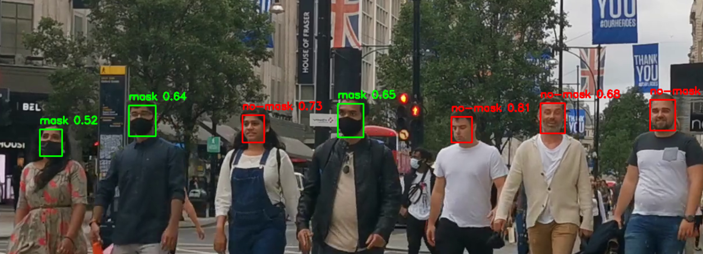
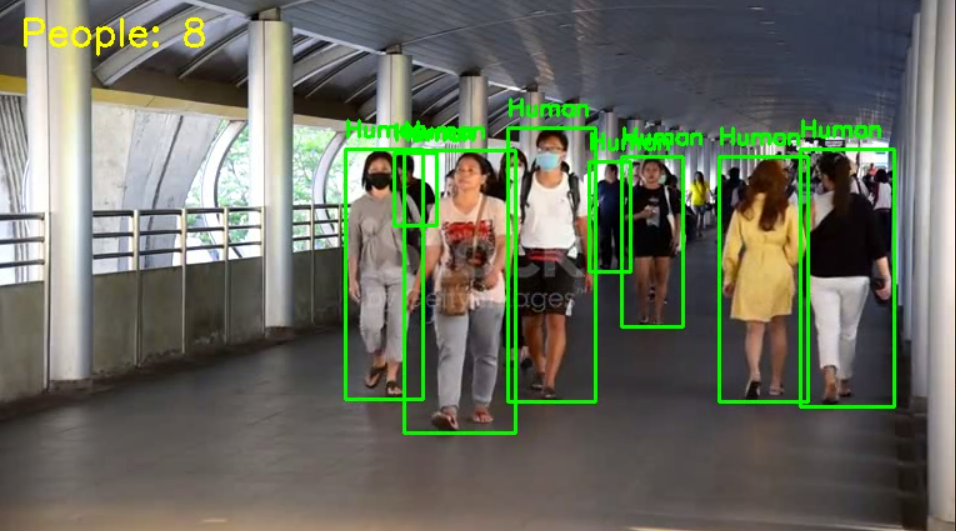
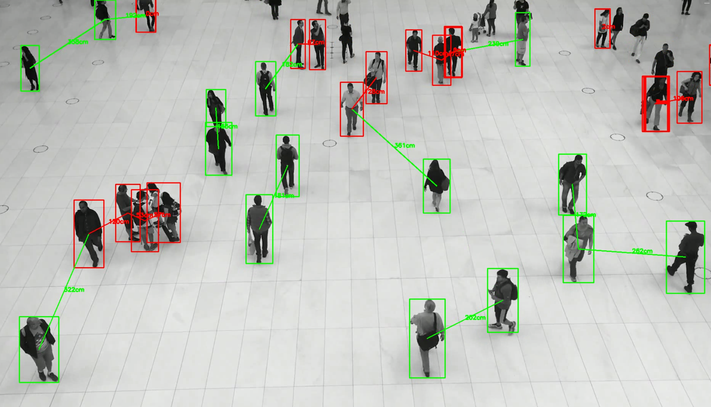
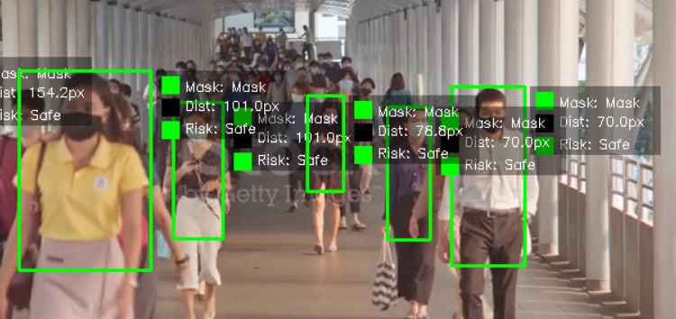
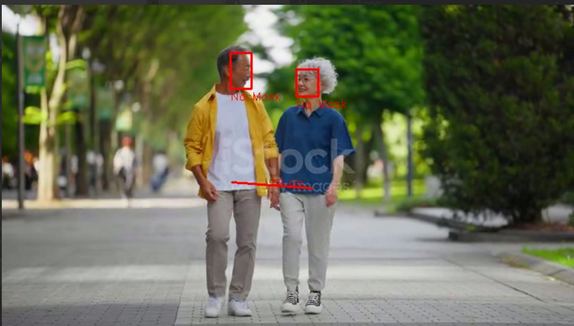
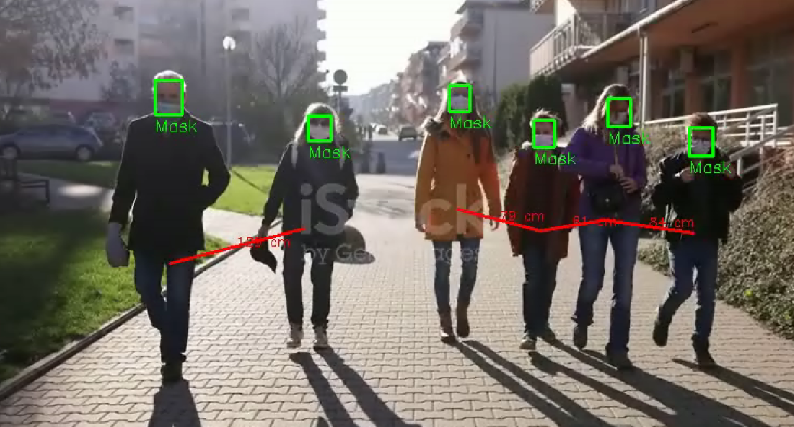
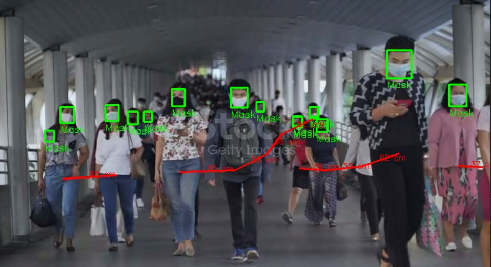

# COVID-19 Vision Monitoring System

Introducing the COVID-19 Vision Monitoring System, developed as part of the Computer Vision course at IU International University of Applied Sciences.

---

## What is COVID-19 Vision Monitoring System? 
This tool help with monitor compliance with COVID-19 protocols in indoor public spaces. It allows users to:
- Detect humans in a video stream.
- Detect if individuals are wearing a mask.
- Estimate social distancing between people.
- Evaluate risk levels (Safe / High Risk) based on mask usage and proximity.
- Save annotated videos showing mask compliance and social distance violations.

video output make monitoring COVID-19 protocols simple and accessible.

---

## How to Install It?
1) Clone the Repository
```bash
git clone https://github.com/RaghadIU/covid19_vision_system.git
```
```bash
cd covid19_vision_system
```
2) Create and activate a virtual environment
```bash
python -m venv venv
```
```bash
venv\Scripts\activate
```
3) Install Python Dependencies 
Make sure you have Python 3.7+ installed. Then, run:
```bash
pip install -r requirements.txt
```




## Mask detection , run:   
```bash
python -m mask_detection.mask_detector --source "videos/sample1.mp4" --out "outputs/mask_out.mp4" --view
```




## Social distance estimator, run:   
```bash
python social_distance/distance_estimator.py --source "videos/sample2.mp4" --out "outputs/distance_out.mp4" --distance_factor 1.5 --view
```




## Human detection , run:   
```bash
python human_detection/human_detector.py --source "videos/sample3.mp4" --out "outputs/human_out.mp4" --view
```



## few people 


## medium people 


## many people 



## multi_model_mask_distance , run:   
```bash
python multi_model_mask_distance.py

```

